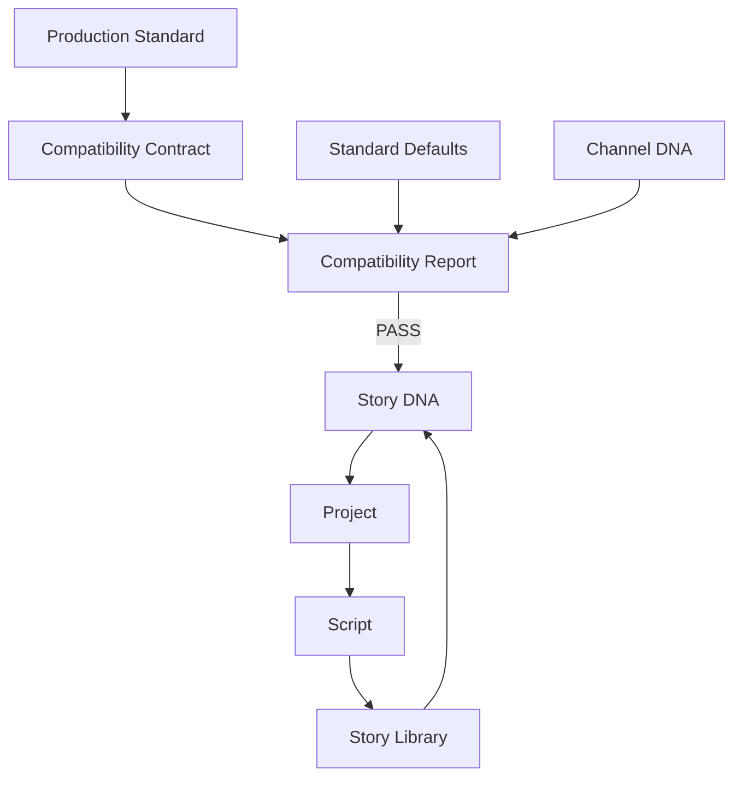

# 데이터 관계

```mermaid
flowchart TD
    S[Production Standard] --> C[Compatibility Contract]
    C --> R[Compatibility Report]
    D[Standard Defaults] --> R
    H[Channel DNA] --> R
    R -->|PASS| T[Story DNA]
    L[Story Library] --> T
    T --> P[Project]
    P --> X[Script]
    X --> L
```

Compatibility Contract는 Standard와 Channel DNA의 경계만 소유한다. Story DNA와 Project는 Channel DNA를 수정할 수 없으며, Standard Defaults는 명시된 채널 값을 덮어쓰지 않는다.
