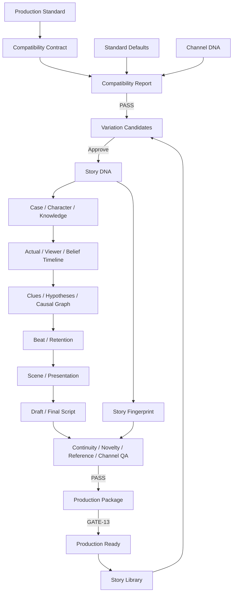
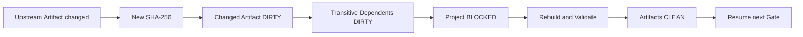

# 데이터와 실행 관계

```mermaid
flowchart TD
    S[Production Standard] --> C[Compatibility Contract]
    C --> R[Compatibility Report]
    D[Standard Defaults] --> R
    H[Channel DNA] --> R
    R -->|PASS| V[Variation Candidates]
    L[Story Library] --> V
    V -->|Approve| T[Story DNA]
    T --> F[Story Fingerprint]
    T --> K[Case / Character / Knowledge]
    K --> M[Actual / Viewer / Belief Timeline]
    M --> Q[Clues / Hypotheses / Causal Graph]
    Q --> B[Beat / Retention]
    B --> N[Scene / Presentation]
    N --> X[Draft / Final Script]
    X --> A[Continuity / Novelty / Reference / Channel QA]
    F --> A
    A -->|PASS| P[Production Package]
    P -->|GATE-13| Z[Production Ready]
    Z --> L
```

```mermaid
flowchart LR
    U[Upstream Artifact changed] --> H[New SHA-256]
    H --> D[Changed Artifact DIRTY]
    D --> T[Transitive Dependents DIRTY]
    T --> B[Project BLOCKED]
    B --> V[Rebuild and Validate]
    V --> C[Artifacts CLEAN]
    C --> G[Resume next Gate]
```

Compatibility Contract는 Required Capability 이름을 소유하고 Channel Schema는 그 내부 형상을 소유한다. Dependency Graph는 Artifact 경로와 Owner Agent를 연결하며 Project State는 현재 Hash와 Gate를 기록한다.
